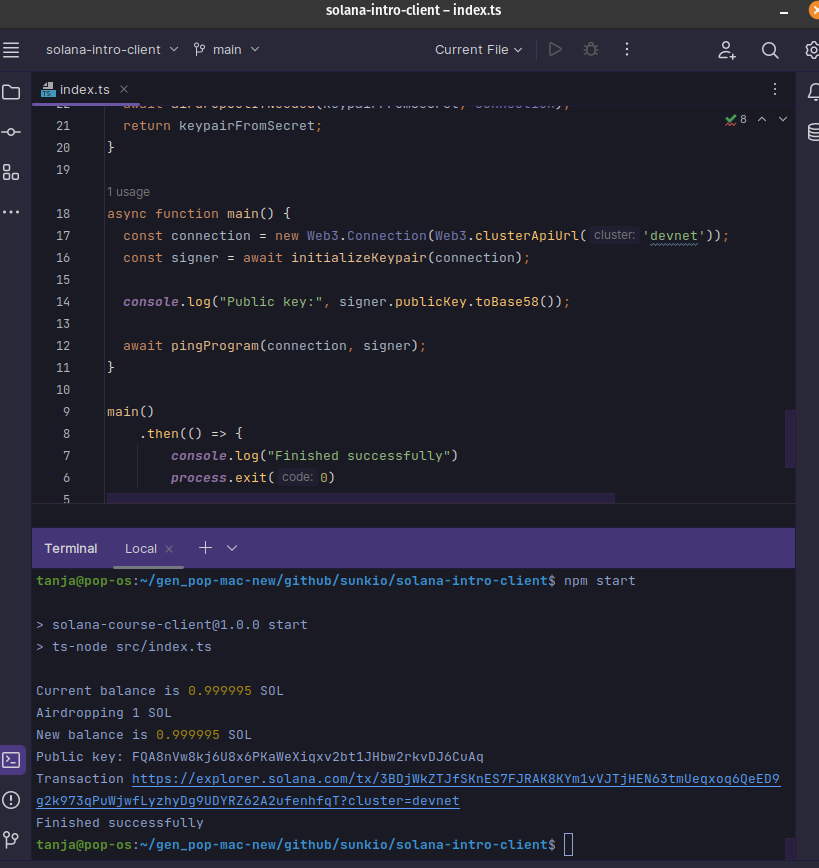
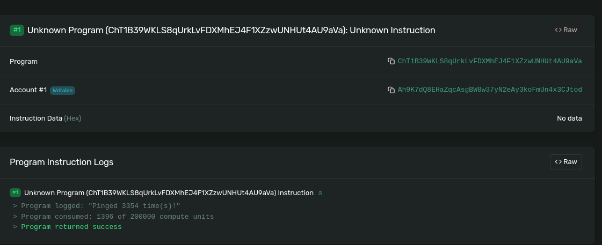

# Solana Intro Client

This is a simple example Solana client built to help developers understand the basics of interacting with the Solana blockchain. The client demonstrates how to connect to a Solana cluster, generate and manage keypairs, request an airdrop, and interact with a simple Solana program that counts how many times it got "pinged".

Solana Intro Client was built as part of the 6-week [Solana Core Developer Program](https://buildspace.so/p/solana-core/) on [buildspace](https://buildspace.so).


*Solana Client CLI Output*


*Solana Explorer Ping Result*

## Table of Contents
- [Features](#features)
- [Getting Started](#getting-started)
  - [Prerequisites](#prerequisites)
  - [Installation](#installation)
- [Usage](#usage)
- [Understanding the Code](#understanding-the-code)
- [Resources](#resources)
- [Contributing](#contributing)
- [License](#license)
- [Support](#support)

## Features
- Connect to a Solana cluster (Devnet)
- Generate a keypair and manage it using a .env file
- Request an airdrop of SOL
- Interact with a simple Solana program

## Getting Started
Follow these steps to set up the project locally.

### Prerequisites
Before getting started, make sure you have the following software installed on your system:

- [Node.js](https://nodejs.org/en/) 

This project was built using Node.js v18.14.0. If you use [NVM](https://github.com/nvm-sh/nvm), you can run `nvm use` to switch to this version.

### Installation
1. [Fork](https://docs.github.com/en/get-started/quickstart/fork-a-repo) and then clone this repository:
   ```
   git clone https://github.com/<your username>/solana-intro-client.git
   ```
2. Change to the project directory:
   ```
   cd solana-intro-client
   ```
3. Install the required packages:
   ```
   npm ci 
   ```
4. Create a `.env` file in the project root directory, and add your private key (optional):
   ```
   PRIVATE_KEY=[your_private_key]
   ```
   If you don't have a private key, the client will generate one for you and request an airdrop of SOL.

## Usage
1. Run the client:
   ```
   npm start
   ```
   The client will connect to the Solana Devnet, create or use an existing keypair, request an airdrop if needed, and interact with the example program.

2. Check the transaction on the Solana Explorer using the provided transaction link.

## Understanding the Code
The main code for the client is located in the `index.ts` file, which is responsible for the following actions:
- Importing the required packages
- Defining the program ID and program data public key
- Defining a function to ping the example program
- Defining a function to request an airdrop of SOL if needed
- Initializing the keypair and connecting to Solana Devnet
- Executing the main function to run the client

## Resources
- [Solana Web3.js Documentation](https://solana-labs.github.io/solana-web3.js/)
- [Solana Developer Guide](https://docs.solana.com/developing)
- [Solana Explorer](https://explorer.solana.com/)
- [Solana Core Developer Program](https://buildspace.so/p/solana-core/) at [buildspace](https://buildspace.so)

## Contributing
Contributions are always welcome! If you'd like to contribute to this project or have any suggestions, feel free to create a new issue or submit a pull request. Please check the [Code of Conduct](./CODE_OF_CONDUCT.md) first.

To submit a pull request, follow these steps:
1. Fork the repository
2. Create your feature branch (`git checkout -b feature/your-feature-name`)
3. Commit your changes (`git commit -am 'Add some feature'`)
4. Push to the branch (`git push origin feature/your-feature-name`)
5. Create a new Pull Request

## License

This project is open-source and available under the [MIT License](./LICENSE.md).

## Support
If you have any questions or need help getting started, please open an issue in the repository or contact me on Twitter: @tanja_codes